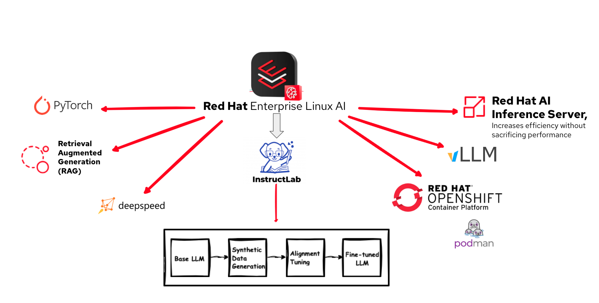

# RHEL AI Red Hat Summit Connet London 2025

# Unlocking Your Company’s Knowledge: Building an AI Assistant with RHEL AI 

# By Maha & Paulo - RHEL AI

## Overview

### Abstract - 1
Build a smart assistant using RHEL AI that learns from your internal knowledge base, delivering fast, accurate answers from technical documentation

### Abstract - 2
Nowadays, it’s more and more common for corporations with a large growth knowledge base, which takes hours to get the correct information or to make sure not to duplicate content. How can we use smart AI to help to solve this problem? And how does RHEL AI fine-tune help quickly unlock this for you?
In this session, we will start explaining a preprocessing of documents from multiple internal sources, cleaning and preparing the data, applying RHEAL AI fine-tune to faster, more effective retrieval, using taxonomy to tailor to the organisation's language, processes and priorities. During this session, you will also learn how the Retrieval Augmented Generation (RAG) pipeline can combine real-time documentation retrieval with the model to deliver fact-based context responses. Finally, we will demonstrate the AI assistant as an internal chatbot to demonstrate the use case.

## Problem Statement

The core problem is that crucial organisational knowledge—including Company policies, Employee Handbooks, Regulatory Compliance Standards and Standard Operating Procedures (SOPs) s severely fragmented and siloed across multiple, disparate platforms such as GitLab, Bitbucket, Confluence, GitHub, and various unindexed PDFs.
This lack of a single source of truth leads to three critical negative outcomes:

  1. Inefficiency and Time Waste: Employees spend a significant and unacceptable amount of time navigating and searching multiple tools, directly reducing productivity and diverting focus from core responsibilities.
  2. Duplication and Inconsistency: The scattering of data leads to the creation of duplicate, non-standardized, and often conflicting or outdated content, which organizations use at their own risk.
  3. High Risk of Non-Compliance: The difficulty in retrieving the authoritative, current version of a policy or standard increases the risk of employees making decisions based on incorrect information or failing to adhere to mandatory policies.
The clear solution required is the implementation of a centralised AI assistant capable of unifying this scattered data, providing employees with quick, reliable, and single-point access to the most accurate knowledge.

## Red Hat Enterprise Linux AI (RHEL AI)

### What is RHEL AI ?

RHEL AI is a foundational model platform from Red Hat for developing, testing, tuning and deploying Large-Language models (LLms) for enterprise use. It helps build AI Assitants to resolve the knowledge base problem.
Its combines of several platform like:.

* InstructLab 
* Granite Open Source LLMs
* Pytorch 
* Red Hat AI Inference Server
* Builtin Drivers for Accelerators 

## Collecting Knowledge Base

We took generic RHEL AI instructions and used Docling project to convert our Documentation. Docling simplifies document processing, parsing diverse formats.

References: https://docling-project.github.io/docling/

